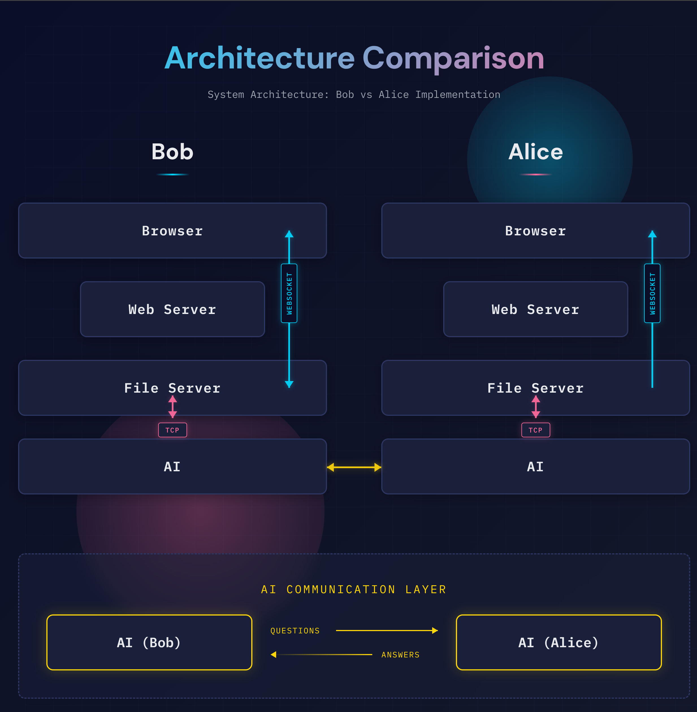

# AI Conversation System



A real-time AI conversation system featuring Bob (who asks questions) and Alice (who answers questions), connected through a Go-based WebSocket server infrastructure. This project demonstrates a modern, concurrent architecture using WebSockets, Go channels, and React frontends.

## Architecture Overview

The system consists of three main components:

```
┌─────────────┐      ┌────────────┐      ┌─────────────┐
│ Bob Client  │◄────►│  AI Server │◄────►│Alice Client │
│  (React)    │  WS  │   (Go)     │  WS  │  (React)    │
│  :5174      │      │  :8003/:8004      │  :5173      │
└─────────────┘      └────────────┘      └─────────────┘
```

### Components

1. **AI Server** (`ai-server/`) - Go-based WebSocket server
   - BobServer: WebSocket server on port 8004
   - AliceServer: WebSocket server on port 8003
   - BobAI: Goroutine that simulates Bob persona
   - AliceAI: Goroutine that simulates Alice persona
   - Channel-based communication between components

2. **Alice Client** (`alice/client/`) - React web app
   - Connects to AI Server on port 8003
   - Receives and displays answers from Alice AI
   - Audio playback with WaveSurfer visualization

3. **Bob Client** (`bob/client/`) - React web app
   - Connects to AI Server on port 8004
   - Sends questions to Bob AI
   - Receives and displays responses
   - Audio playback with WaveSurfer visualization

## Project Structure

```
conversation/
├── ai-server/           # Go WebSocket server
│   ├── cmd/
│   │   └── main.go              # Entry point
│   ├── internal/
│   │   ├── server/              # WebSocket servers
│   │   ├── ai/                  # AI persona components
│   │   └── types/               # Shared types
│   ├── config/                  # Configuration
│   └── README.md
├── alice/
│   └── client/          # Alice React web app
│       ├── src/
│       │   ├── App.tsx
│       │   ├── components/
│       │   └── services/
│       └── README.md
├── bob/
│   └── client/          # Bob React web app
│       ├── src/
│       │   ├── App.tsx
│       │   ├── components/
│       │   └── services/
│       └── README.md
└── prompts/             # Design specifications
    ├── ai-server.md
    └── ai-server-plan.md
```

## Quick Start

### 1. Start the AI Server

```bash
cd ai-server
go build -o ai-server ./cmd/main.go
./ai-server
```

The AI server will start:
- Alice WebSocket: `ws://localhost:8003`
- Bob WebSocket: `ws://localhost:8004`

### 2. Start the Alice Client

In a new terminal:

```bash
cd alice/client
npm install
npm run dev
```

Alice client: `http://localhost:5173`

### 3. Start the Bob Client

In another terminal:

```bash
cd bob/client
npm install
npm run dev
```

Bob client: `http://localhost:5174`

### 4. Test the System

1. Open both web clients in your browser
2. In the Bob client, enter a question and click "Go Ask Alice"
3. Watch the conversation flow:
   - Bob sends question → BobAI processes → AliceAI receives
   - AliceAI generates answer → Alice client displays
   - BobAI receives answer → Bob client displays

## Message Format

All WebSocket messages use JSON:

```json
{
  "text": "Message text content",
  "audio": "/audio/file.mp3"
}
```

## Technology Stack

### AI Server (Go)
- **Language**: Go 1.21+
- **WebSocket**: gorilla/websocket
- **Concurrency**: Goroutines and channels
- **Architecture**: Clean, modular design with separate packages

### Alice & Bob Clients
- **Framework**: React 19 with TypeScript
- **Build Tool**: Vite
- **Audio**: WaveSurfer.js for visualization
- **Styling**: Modern CSS with responsive design

## Configuration

### AI Server

Environment variables:
- `ALICE_PORT`: Alice WebSocket port (default: 8003)
- `BOB_PORT`: Bob WebSocket port (default: 8004)
- `AUDIO_DIR`: Audio files directory (default: ./public/audio)
- `CHANNEL_BUFFER`: Channel buffer size (default: 10)

### Alice Client

Environment variables:
- `VITE_WS_URL`: WebSocket URL (default: ws://localhost:8003)

### Bob Client

WebSocket URL is configured in `src/App.tsx` (default: ws://localhost:8004)

## Current Implementation Status

- ✅ Go-based WebSocket server infrastructure
- ✅ Concurrent AI persona components
- ✅ Channel-based inter-component communication
- ✅ React clients with WebSocket connectivity
- ✅ Audio playback with visualization
- ✅ Connection status indicators
- ✅ Auto-reconnection support
- ✅ Dummy AI responses (scaffolding)
- ⏳ LLM integration (planned)
- ⏳ Audio generation/TTS (planned)

## Development

### Building the AI Server

```bash
cd ai-server
go mod tidy
go build -o ai-server ./cmd/main.go
```

### Running in Development

```bash
# AI Server
cd ai-server
go run ./cmd/main.go

# Alice Client
cd alice/client
npm run dev

# Bob Client
cd bob/client
npm run dev
```

## Future Enhancements

1. **LLM Integration**
   - Integrate with Anthropic Claude or OpenAI
   - Implement intelligent question/answer generation
   - Maintain conversation context

2. **Audio Generation**
   - Text-to-speech integration
   - Audio file management
   - Streaming audio support

3. **Advanced Features**
   - Multiple concurrent conversations
   - Conversation history persistence
   - Admin dashboard
   - Metrics and monitoring
   - User authentication

## Documentation

- [AI Server Documentation](ai-server/README.md)
- [Alice Client Documentation](alice/README.md)
- [Bob Client Documentation](bob/README.md)
- [Design Prompts](prompts/)

## License

This is a demonstration/comparison project for evaluating AI coding assistants.

## Contributing

This project is designed to compare implementations by different AI assistants. Each implementation should remain self-contained and consistent with its original design.
